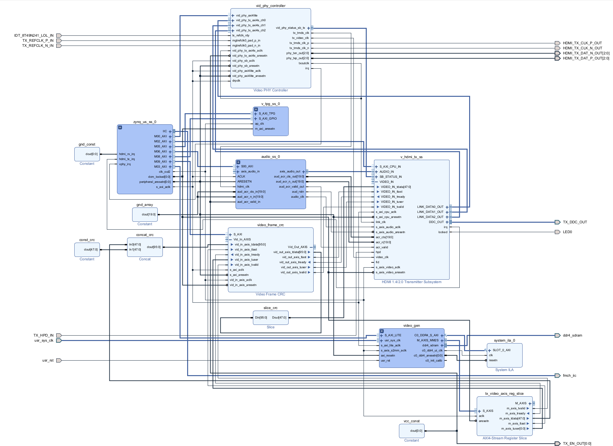
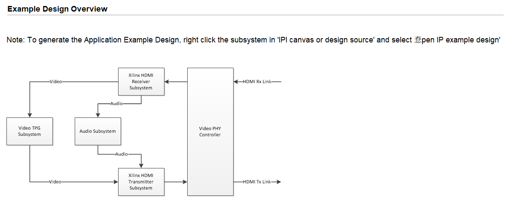
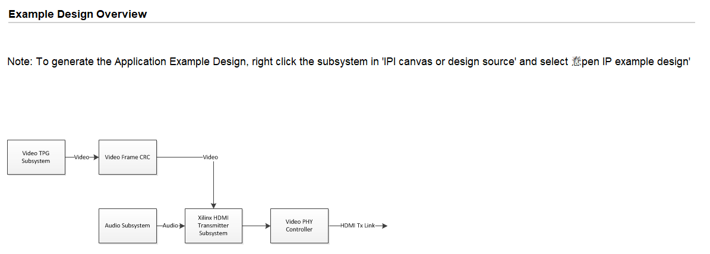
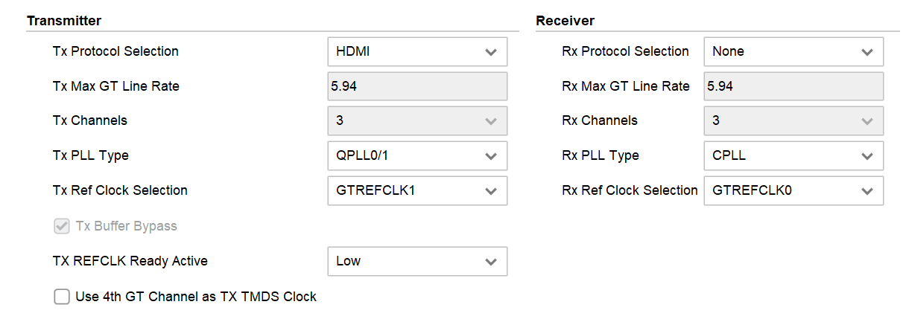
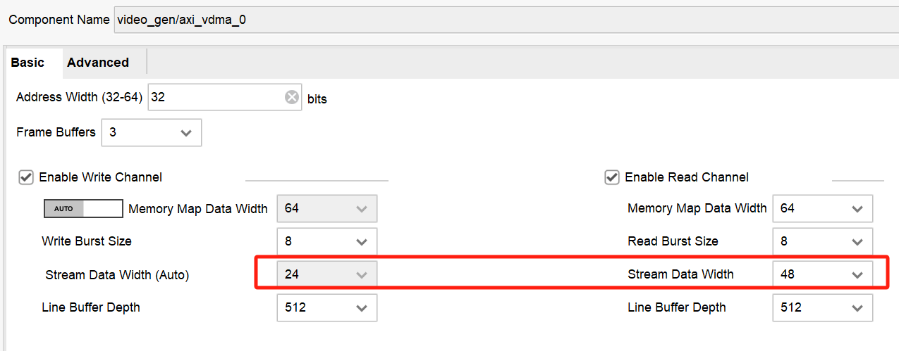
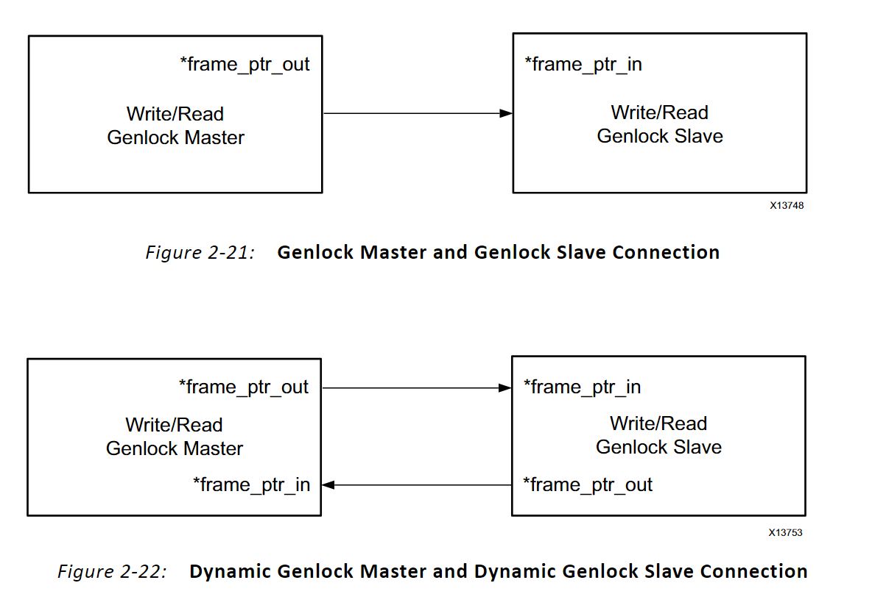
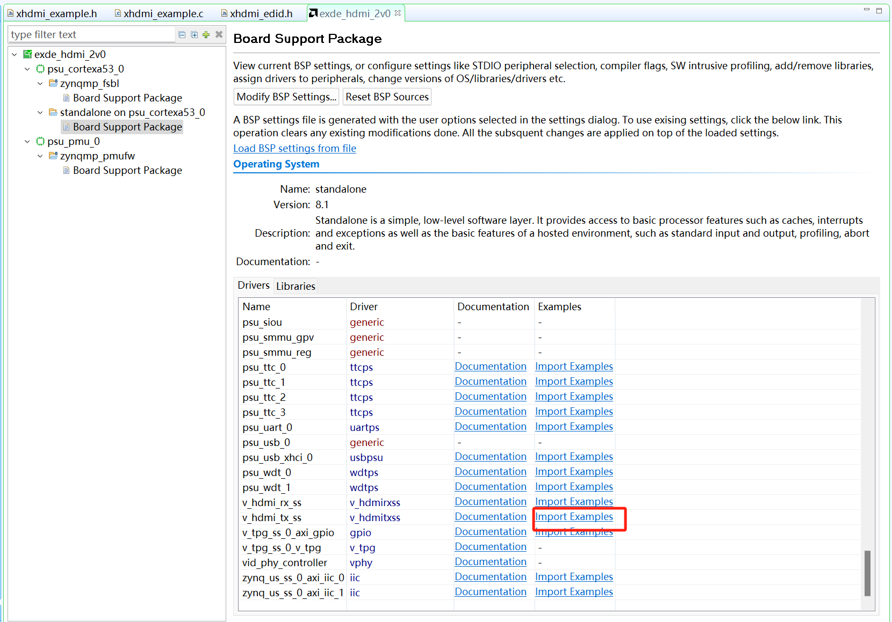
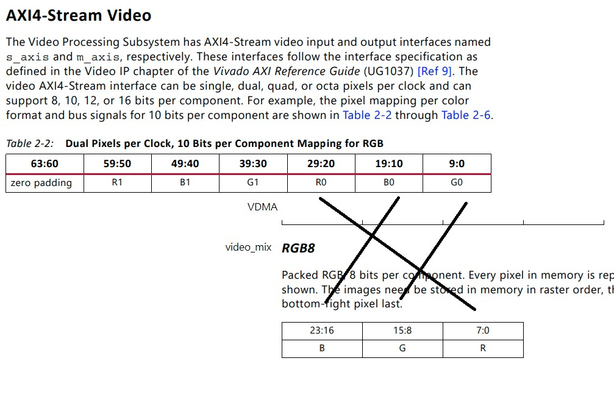

# v_hdmi_txss（hdmi2.0使用）
The project modified the tpg data generation section based on xilinx's hdmi2.0 tx IP core, changing it to a custom color bar.

## 设计目的

​        hdmi2.0以及hdmi2.1虽然xilinx官方提供了相应的ip以及example，但是视频流数据只能选择来自上位机的视频流输出以及tpg生成彩条等部分。这里模拟一个外部视频流数据输入到hdmi2.0.这个视频流数据会经过vdma缓存到ddr（处理时钟域不同步）。然后再通过vitis读取ddr中的数据并且存储到bin文件中。接下来通过imageJ来解析这个bin文件并且显示出相对应的图片供用户观察效果。

​	验证的开发板为zcu104.

## 设计框图

整个工程的block design框图如上所示：video_gen模块由用户控制，其余的hdmi tx模块来自hdmi2.0 ip所提供的example。打开video_gen这个hier可以看到这个模块负责处理彩条生成以及缓存到ddr。缓存功能由vdma实现。

整个hdmi2.0的框图如下：

这是phy层同时打开tx和rx端的example。当phy层只打开tx通道后的example框图如下：

这里由于数据是来自axis_gen，所以phy层只打开tx通道，example只选择tx only。

​														tx only选择（来自hdmi2.0）

​													phy层关闭rx通道（来自video phy controller）

## 设计思路

### 1.axis_gen

​	这个模块负责生成相应的视频流数据，模拟摄像头采集到的数据。这里配置一张图片的分辨率是3840*2160.时钟选择300MHz。同时这里设置了相关的图像控制信号。

​	m_axis_tuser:一帧图像开始的信号。m_axis_tlast:一帧图像结束的信号。m_axis_tvalid:高有效，表明主机开始向从机发送数据。参考axis协议。

### 2.vdma

​	vdma配置如下：两个数据位宽的选择。

​										Basic 配置

​	其中一个是axis_gen写入到vdma的位宽，另外一个是从ddr读出来的位宽，设置为48主要是和example中的crc的位宽匹配。

​										Advance 配置

​	这里的write channel 和read channel的Fsync options配置为none，表示运行在自由模式下。即不受任何信号的控制。同步锁相模式配置为master和slave。

#### 2.1同步锁相（Genlock）模式：

​	在许多视频应用中，数据的生产者和消费者运行速率不同。为了避免这种速率不匹配可能导致的潜在问题，通常会使用帧缓冲技术。帧缓冲为存储多帧数据分配了多个帧的内存空间。数据生产者向一个缓冲区写入数据，而消费者则从另一个缓冲区读取数据。AXI VDMA的Genlock功能通过防止读写通道同时访问同一帧数据来补偿这一点。

​	AXI VDMA支持四种Genlock同步模式。它们是Genlock主模式、Genlock从模式、动态Genlock主模式和动态Genlock从模式。图2-21和图2-22显示了有效的Genlock连接。

*重要提示：如果在内核内部建立了内部Genlock连接，并且参数C_MM2S_GENLOCK_NUM_MASTERS=1（C_S2MM_GENLOCK_NUM_MASTERS=1），则默认情况下不会暴露mm2s_frame_ptr_in（s2mm_frame_ptr_in）端口。当（i）两个VDMA通道都被启用，并且（ii）一个通道是主模式而另一个是从模式（或一个通道是动态主模式而另一个是动态从模式）时，就在内核内部建立了内部Genlock连接。这意味着您不需要进行显式的外部连接。*

*如果您是高级用户，并且出于某些特定目的需要访问mm2s_frame_ptr_in（s2mm_frame_ptr_in）端口，您可以通过在Vivado设计工具（或IP集成器）中使用Tcl控制台命令，设置参数C_MM2S_GENLOCK_NUM_MASTERS > 1（C_S2MM_GENLOCK_NUM_MASTERS > 1）来实现。*

​	详细的内容参考pg020.

## 设计验证

​	按照block design完成整个工程的连接，由于按照board file配置，所以这里的引脚并未设置。一切都是由board file来配置的，包括一些ip的设置。比如ddr。这里配置好下面三个参数即可完成ddr的引脚及型号的选择。

​	接下来按照synthesis-->implementation-->generate bitstream这个顺序生成bit文件，然后创建xsa。打开vitis。

​	创建platform并且打开vitis界面。

​	在板级支持包上找到相应的example，并且根据板卡支持的cpu选择a53处理器。打开这个文件。

​	由于添加了vdma，所以这里需要对vdma做出配置。配置可以参考pg020给出的步骤。

1.Configure the Write channel registers as follows.

a.   Set S2MM_VDMACR (30h) to 8Bh. This enables run/stop, Circular_Park, GenlockEn, and GenlockSrc. In this case, external connections of frame pointers are not required. If Repeat Enable and Interrupt on error is required, set bit 15 and bit 14 of this register.

 b.   Set S2MM_Start_Address 1 (ACh) through S2MM_Start_Address 3 (B4h) to their required locations. These locations can be static (based on maximum frame size) or dynamic (based on actual frame size).

c.   Set S2MM_FRMDLY_STRIDE (A8h) to the appropriate value. FRMDLY is not applicable for the Dynamic Genlock Master. STRIDE is the number of bytes per line.

d.   Set S2MM_HSIZE (A4h) to the number of bytes per line.

e.   Set S2MM_VSIZE (A0h) to the number of lines per frame. VSIZE must be set last and starts the S2MM VDMA transactions.

2.Configure the Read channel registers as follows.

a.   Set MM2S_VDMACR (00h) to 8Bh. This enables run/stop, Circular_Park, GenlockEn, and GenlockSrc. In this case, external connections of frame pointers are not required. If Interrupt on error is required, then set bit 14 of this register.

b.   Set MM2S_Start_Address1 (5Ch) through MM2S_Start_Address 3 (64h) to their required locations. These locations should match their S2MM_Start_Address counterparts.

c.   Set MM2S_FRMDLY_STRIDE (58h) to the appropriate value. FRMDLY is not applicable for the Dynamic Genlock Slave. STRIDE is the number of bytes per line.

d.   Set MM2S_HSIZE (54h) to the number of bytes per line.

e.   Set MM2S_VSIZE (50h) to the number of lines per frame. VSIZE must be set last and starts the MM2S VDMA transactions.

​	对应的，可以参考vitis下的code。

	Xil_Out32(XPAR_VIDEO_GEN_AXI_VDMA_0_BASEADDR + 0x30,0x8b);
	Xil_Out32(XPAR_VIDEO_GEN_AXI_VDMA_0_BASEADDR + 0xac,VIDEO_BASE_ADDR);
	Xil_Out32(XPAR_VIDEO_GEN_AXI_VDMA_0_BASEADDR + 0xb0,VIDEO_BASE_ADDR + 0x10000000);
	Xil_Out32(XPAR_VIDEO_GEN_AXI_VDMA_0_BASEADDR + 0xb4,VIDEO_BASE_ADDR + 0x20000000);
	Xil_Out32(XPAR_VIDEO_GEN_AXI_VDMA_0_BASEADDR + 0xa8,IMAGE_WIDTH*3);
	Xil_Out32(XPAR_VIDEO_GEN_AXI_VDMA_0_BASEADDR + 0xa4,IMAGE_WIDTH*3);
	Xil_Out32(XPAR_VIDEO_GEN_AXI_VDMA_0_BASEADDR + 0xa0,IMAGE_HEIGHT);
	
	Xil_Out32(XPAR_VIDEO_GEN_AXI_VDMA_0_BASEADDR + 0x00,0x8b);
	Xil_Out32(XPAR_VIDEO_GEN_AXI_VDMA_0_BASEADDR + 0x5c,VIDEO_BASE_ADDR);
	Xil_Out32(XPAR_VIDEO_GEN_AXI_VDMA_0_BASEADDR + 0x60,VIDEO_BASE_ADDR + 0x10000000);
	Xil_Out32(XPAR_VIDEO_GEN_AXI_VDMA_0_BASEADDR + 0x64,VIDEO_BASE_ADDR + 0x20000000);
	Xil_Out32(XPAR_VIDEO_GEN_AXI_VDMA_0_BASEADDR + 0x58,IMAGE_WIDTH*3);
	Xil_Out32(XPAR_VIDEO_GEN_AXI_VDMA_0_BASEADDR + 0x54,IMAGE_WIDTH*3);
	Xil_Out32(XPAR_VIDEO_GEN_AXI_VDMA_0_BASEADDR + 0x50,IMAGE_HEIGHT);

接下来编译vitis并且下载到板卡上进行验证。

下载完成之后可以看到串口打印的信息。VIDEO_BASE_ADDR为读写ddr的基地址，这里是pl端的，设置为0x00000000.如果是ps侧的ddr，起始地址要避免和指令的起始地址冲突。（0x40000000）

`mrd -bin -file image.bin 0x000000000 58982400`

IMAGE_WIDTH  IMAGE_HEIGHT这两个需要自行声明，表示图像的宽度和高度。

在vitis终端输入这条命令查看效果。

注意：vdma在写入图像时会将RGB中的R,G和B倒换顺序。最后以BGR的格式写入DDR，所以读出的图片会和预期有差异。

